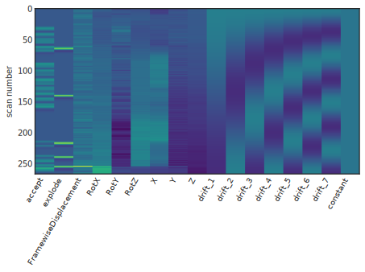
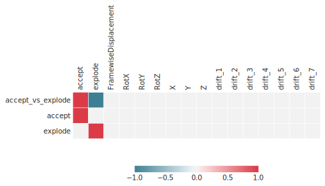
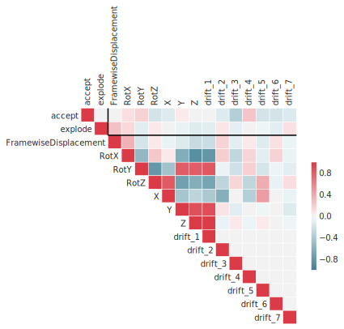
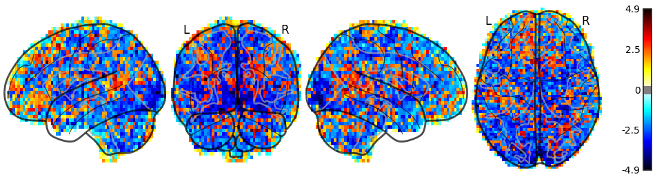
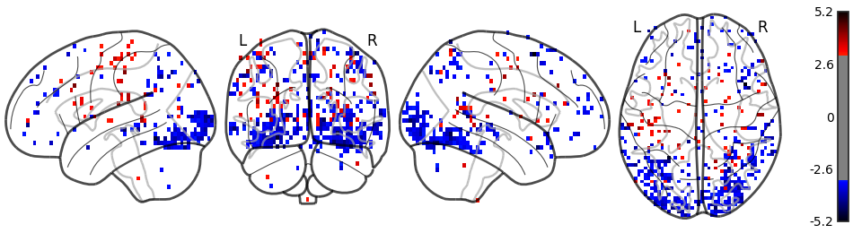

FitLins - Fitting Linear Models to fMRI data
============================================

FitLins is a tool for estimating linear models, defined by the `BIDS Model`_
specification proposal, to BIDS-formatted datasets.

This software is in alpha stage, and should be considered unstable.
Users are welcome to test the software, and open issues.

The CLI follows the `BIDS-Apps`_ convention:

Usage::

    fitlins <bids_root> <out_dir> <analysis_level> [--model <model_name>]

See the output of ``fitlins --help`` for all valid options::

    usage: fitlins [-h] [-v]
                   [--participant-label PARTICIPANT_LABEL [PARTICIPANT_LABEL ...]]
                   [-m MODEL] [-p PREPROC_DIR] [--space {MNI152NLin2009cAsym}]
                   [--debug]
                   bids_dir output_dir {run,session,participant,dataset}

    FitLins: Workflows for Fitting Linear models to fMRI

    positional arguments:
      bids_dir              the root folder of a BIDS valid dataset (sub-XXXXX folders should be
                            found at the top level in this folder).
      output_dir            the output path for the outcomes of preprocessing and visual reports
      {run,session,participant,dataset}
                            processing stage to be runa (see BIDS-Apps specification).

    optional arguments:
      -h, --help            show this help message and exit
      -v, --version         show program's version number and exit

    Options for filtering BIDS queries:
      --participant-label PARTICIPANT_LABEL [PARTICIPANT_LABEL ...]
                            one or more participant identifiers (the sub- prefix can be removed)
      -m MODEL, --model MODEL
                            location of BIDS model description (default bids_dir/model.json)
      -p PREPROC_DIR, --preproc-dir PREPROC_DIR
                            location of preprocessed data (default output_dir/fmriprep)
      --space {MNI152NLin2009cAsym}
                            registered space of input datasets

    Options to handle performance:
      --debug               run debug version of workflow

At present, FitLins does not support smoothing or operate in subject-native
space.
It is developed against `FMRIPREP`_-preprocessed datasets, but is intended to
work with any dataset following the `BIDS Derivatives`_ draft specification.

Reporting
---------

FitLins generates a report at each level of analysis, detailing the design
matrix and contrast, and showing maximum-intensity projections ("glass brain"
plots) of each parameter estimate and contrast.

* `Example first-level report <example/ds000030/derivatives/fitlins/sub-10171/sub-10171_model-ds000030Bart.html>`_
* `Example second-level report <example/ds000030/derivatives/fitlins/model-ds000030Bart.html>`_

Model visualizations
~~~~~~~~~~~~~~~~~~~~

In first-level models, design matrices, contrast matrices are plotted, as well
as correlation matrices showing the correlation of explanatory variables in the
design.

Statistical visualizations
~~~~~~~~~~~~~~~~~~~~~~~~~~

Statistical maps are visualized as maximum-intensity projections of z-scores.
For first-level analyses, these are unthresholded to facilitate overall
comparison of spatial patterns.
Higher level analyses are thresholded at ``p < 0.001``, uncorrected.

Warning
-------

FitLins is in Alpha-stage, and is not suitable for use as a library, as the
internal organization may change substantially without deprecation periods.
Similarly the outputs (or derivatives) are subject to change, as experience
and user feedback prompt.
The command-line interface outlined above should be fairly stable, however.

.. _"BIDS Model": https://docs.google.com/document/d/1bq5eNDHTb6Nkx3WUiOBgKvLNnaa5OMcGtD0AZ9yms2M/
.. _"BIDS Derivatives": https://docs.google.com/document/d/1Wwc4A6Mow4ZPPszDIWfCUCRNstn7d_zzaWPcfcHmgI4/
.. _BIDS-Apps: http://bids-apps.neuroimaging.io
.. _FMRIPREP: https://fmriprep.readthedocs.io
